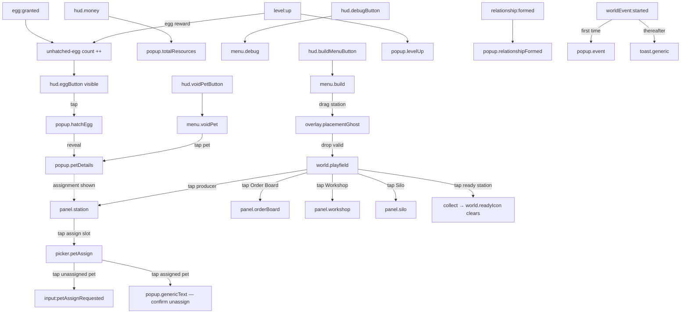

# VoidDay — UI Inventory

**Spec:** `docs/VoidDay-Spec-unity.md` · **Style guide:** `docs/StyleGuide.md` · **Generated:** 2026-07-17

This doc is the **naming authority** for UI surfaces. Milestone docs and mockups cite these ids; they do not invent their own descriptions. It does not reference milestones (scheduling lives in the milestone summary, one direction only).

**Layer note (CLAUDE.md):** every interaction below is expressed as the **intent it emits**, never the action it takes. A surface captures input and publishes an `input:*` event (§15); it holds no rule and calls no system. State shown on a surface is read from Core state / domain events, never computed in the View.

**Global chrome (StyleGuide "Type & UI"):** chunky rounded panels (corner radius ~24–32px @1080w), soft drop shadows, generous padding, big rounded buttons. Min touch target ~120px @1080w. One rounded-sans family — **Bold** (headers/numbers), **SemiBold** (buttons/labels), **Regular** (body/blurbs). Filled, rounded, single-weight icons. Reference resolution 1080×1920, HUD respects safe-area margins for 9:19.5–9:21. **The void accent (`#8B5CF6` violet ↔ `#22D3EE` cyan) appears in UI only where UI touches void content** — VoidPet menu, egg/hatch popups, relationship hearts, void-event toasts. All other farm UI stays warm/neutral. Every tap that does something gives the standard pop (scale `0→1.12→1.0`, ease-out-back, ~0.18s).

**Design reference (user decision):** every purchase / queue / fulfill surface **copies HayDay's flow exactly, in its simplest form that meets this prototype's needs.** Concretely that means the two shared patterns below — reused by every recipe, upgrade, and order surface so the mockup artist draws the interaction once.

---

## Shared patterns

Drawn once, reused across surfaces. A surface entry that says "purchase row" or "order card" means exactly this.

### pattern.purchaseRow — HayDay-simple purchase / queue row
Used by `panel.station` (recipe rows **and** station-upgrade rows), `panel.workshop`, and `panel.silo`. One flat rounded row:
- **What you get** — the output/effect: an icon (recipe output, §5.2) or a one-line procedural effect description (§3.6, for upgrades).
- **What it costs** — input resources with quantities as small icons (recipe inputs / upgrade cost), or a money cost (build/universal/silo-capacity upgrades). For upgrades also show **current tier → next tier**.
- **One action control** — a single rounded button (`Queue` for recipes, `Buy` for upgrades). The whole row may be the tap target (HayDay taps the item, not a tiny button).
- **States:** **available** (affordable) → button enabled; **can't-afford** (cost > held resources/money) → button + row **disabled, grayscale** (state-signal "locked"), cost shown in the warning color; **maxed** (upgrades only, top tier reached) → "Maxed", no button; **queue-full** (recipes only, at queue depth §4.3) → disabled until a slot frees.
- **Interaction:** tap → the surface's intent (`input:jobQueueRequested` or `input:upgradePurchaseRequested`). Inputs/cost are consumed by Core, not the row.

### pattern.orderCard — HayDay-simple order card
Used by `panel.orderBoard`, one per filled slot:
- **Requested goods** — each requested resource as icon + quantity. Beside each, a **have/need signal**: a check when you hold enough, the shortfall in the warning color when you don't (HayDay's red count). Data: request from the order, held amount from Core resource state.
- **Reward** — cash + XP earned (§6), derived Core-side.
- **Fill control** — a single rounded **Fill** button (HayDay's deliver/truck action), **enabled only when every requested good is held**, disabled+grayscale otherwise.
- **Skip control** — an **X** in the corner: single tap, no confirm, free (§6). Slot immediately begins refilling.
- **Interaction:** Fill → `input:orderFulfillRequested {orderId}`; X → `input:orderSkipRequested {orderId}`.

---

## Surfaces

| id | Name | Type | Trigger | Mockup needed |
|---|---|---|---|---|
| `hud.buildMenuButton` | Build menu button | HUD | always (bottom-left) | yes |
| `hud.money` | Money counter | HUD | always (top-right) | yes |
| `hud.levelXp` | Level badge + XP bar | HUD | always (top-center) | yes |
| `hud.debugButton` | Debug menu button | HUD | always (top-left) | yes |
| `hud.voidPetButton` | VoidPet menu button | HUD | after first pet owned (bottom-right) | yes |
| `hud.eggButton` | Unhatched-egg indicator | HUD | ≥1 unhatched egg held (top-right) | yes |
| `menu.build` | Build menu | menu | `hud.buildMenuButton` | yes |
| `menu.voidPet` | VoidPet menu | menu | `hud.voidPetButton` | yes |
| `menu.debug` | Debug menu | menu | `hud.debugButton` | yes |
| `picker.petAssign` | VoidPet assignment grid | picker | tap assignment slot in `panel.station` | yes |
| `panel.station` | Producer station panel | panel | 2nd/blocked tap on a producer | yes |
| `panel.orderBoard` | Order Board | panel | tap Order Board | yes |
| `panel.workshop` | Workshop upgrades | panel | tap Workshop | yes |
| `panel.silo` | Silo upgrades | panel | tap Silo | yes |
| `popup.levelUp` | Level up | popup | `level:up` | yes |
| `popup.hatchEgg` | Hatch egg | popup | tap `hud.eggButton` | yes |
| `popup.petDetails` | VoidPet details | popup | tap pet in `menu.voidPet` | yes |
| `popup.totalResources` | Total resources | popup | tap `hud.money` | yes |
| `popup.relationshipFormed` | Relationship formed | popup | `relationship:formed` | yes |
| `popup.genericText` | Generic text/dialogue | popup | data-driven | yes |
| `popup.event` | World event | popup | `worldEvent:started` (first time) | yes |
| `toast.generic` | Toast | toast | data-driven | yes |
| `overlay.placementGhost` | Placement ghost | overlay | drag from `menu.build` | yes |
| `overlay.moveGhost` | Move ghost | overlay | long-press a placed station | yes |
| `world.station` | Station body | in-world | station exists | (art, not UI) |
| `world.progressBar` | Working progress bar | in-world | job running | yes |
| `world.readyIcon` | Ready-to-collect icon | in-world | job complete | yes |
| `world.storageFull` | Storage-full state | in-world | collection refused | yes |
| `world.assignedPet` | Assigned VoidPet | in-world | pet assigned | (art, not UI) |
| `world.relationshipHeart` | Relationship heart | in-world | two pets in range | yes |
| `world.playfield` | Play field | in-world | always | (no chrome) |

---

## Screen Map

---

## HUD

Screen-space UGUI overlaid on the 3D world (§12.1). Persistent. Warm/neutral chrome except `hud.voidPetButton`, which may carry the void accent (it gates void content).

### hud.buildMenuButton — Build menu button
- **Type:** HUD · **Spec:** §12.1, §12.2
- **Purpose:** open the build menu and start station placement.
- **Trigger:** always visible. **Position:** bottom-left, inside safe area.
- **Contents:** one fat rounded icon button (build/hammer glyph). No label required.
- **States:** default; **active** (menu open — pressed/highlighted); **drag-target** — while a station is being dragged, dragging back over this button is the cancel affordance and re-opens the menu (§12.2).
- **Interactions:** tap → toggles `menu.build` open/closed (local view state; no domain intent). During a placement drag, acts as the cancel zone (see `overlay.placementGhost`).
- **Visual:** rounded button, soft shadow, ~120px min. Farm-neutral.

### hud.money — Money counter
- **Type:** HUD · **Spec:** §12.1
- **Purpose:** show current cash; entry point to the total-resource popup.
- **Trigger:** always visible. **Position:** top-right, safe area.
- **Contents:** coin icon + money value (Bold numerals), sourced from `money:changed {total}`.
- **States:** default; value **pop** on `money:changed` (standard pop tween); optional cash chime is an audio listener, not UI.
- **Interactions:** tap → opens `popup.totalResources`; tap again (or the popup's dismiss) closes it (local view toggle).
- **Visual:** rounded pill, farm-neutral.

### hud.levelXp — Level badge + XP bar
- **Type:** HUD · **Spec:** §12.1, §9
- **Purpose:** show current level and progress to next.
- **Trigger:** always visible. **Position:** top-center, safe area.
- **Contents:** level badge (Bold number) + horizontal XP fill bar. Level from `level:up {level}`; fill from `xp:gained {amount}` against the current `LevelSO` threshold. **This is display of Core state — the View does not compute the threshold, it reads it.**
- **States:** default; XP fill **animates** on `xp:gained`; badge **pops** on `level:up`.
- **Interactions:** none specified (display-only). *(Inferred: not tappable — spec lists no action.)*
- **Visual:** rounded bar on a rounded plinth, farm-neutral. Fill uses the working/positive green or neutral; **not** the void accent (XP is farm progress, not void content).

### hud.debugButton — Debug menu button
- **Type:** HUD · **Spec:** §12.1, §12.7
- **Purpose:** open the debug menu.
- **Trigger:** always visible (prototype). **Position:** top-left, safe area.
- **Contents:** small rounded icon button (gear/bug glyph).
- **States:** default; active (menu open).
- **Interactions:** tap → toggles `menu.debug` (local view state).
- **Visual:** deliberately utilitarian; farm-neutral. **Notes:** likely removed/hidden for a real build — prototype affordance.

### hud.voidPetButton — VoidPet menu button
- **Type:** HUD · **Spec:** §12.1, §10
- **Purpose:** open the VoidPet collection menu.
- **Trigger:** **hidden until the player owns their first VoidPet**, then always visible (§12.1). Appears on first `egg:hatched`. **Position:** bottom-right, safe area.
- **Contents:** rounded icon button (pet silhouette glyph).
- **States:** **hidden** (no pets yet — this is a real state, not a footnote); default (owned ≥1); active (menu open); optional **new-pet badge** *(inferred — spec doesn't specify, flagged in Assumptions)*.
- **Interactions:** tap → toggles `menu.voidPet` (local view state).
- **Visual:** **may carry the void accent** (violet sheen/glow) — it gates void content. Reveal on first appearance uses the standard pop.

### hud.eggButton — Unhatched-egg indicator
- **Type:** HUD · **Spec:** §10.1, §12.4 *(user decision — resolves "where unhatched eggs live")*
- **Purpose:** hold granted-but-unhatched eggs and let the player start the hatch sequence on demand.
- **Trigger:** **appears once the player holds ≥1 unhatched egg**, hidden otherwise. **Position:** top-right cluster (near `hud.money` — see Notes on layout).
- **Contents:** an egg icon (void-accent, bloom) + a **count badge** when more than one egg is held. Count from accumulated `egg:granted` minus hatched.
- **States:** **hidden** (0 eggs); **single** (1 egg, no badge); **multiple** (badge shows count). New-egg arrival uses the standard pop + glow-flash.
- **Interactions:** tap → opens `popup.hatchEgg` for the next egg. Eggs from **any** source — level-up rewards and the order-fulfillment egg chance (§10.1) — funnel here; nothing auto-opens the hatch popup, so grants never interrupt play.
- **Visual:** **void-accent** egg (`#8B5CF6`), bloom. **Notes:** top-right also hosts `hud.money`; the two share that corner and need layout coordination (money on top, egg below, or egg inboard of money) — flag for the mockup.

---

## Menus

### menu.build — Build menu
- **Type:** menu · **Spec:** §12.3, §12.2, §4.3, §8, §9
- **Purpose:** browse buildable stations and drag one onto the map.
- **Trigger:** `hud.buildMenuButton`. **Dismissal:** tap the button again, or it **retracts as you drag a station off it** (§12.2). **Modal:** no — the world stays interactive (you drag onto it).
- **Position:** anchored bottom-left, expanding from `hud.buildMenuButton`. A rounded tray/shelf of station entries.
- **Contents:** one entry per station type (Field, Henhouse, Pasture, Creamery, Bakery, Silo, Workshop, Order Board — §4.2). Each entry:
  - Station **primitive/mesh thumbnail**, tinted by `placeholderColor` (StyleGuide station table).
  - Station **name** (SemiBold) — `StationSO.displayName`.
  - **Build cost** in money (§4.3) — `StationSO`.
  - Reads unlock state from player level vs `StationSO.unlockLevel` (§9).
- **States** *(HayDay-simple: the roster is always fully shown; unavailable entries stay visible but disabled and say why — user decision)*:
  - **Available** — full color, draggable.
  - **Locked** (below unlock level, §12.3) — **desaturated grayscale + lock icon** (StyleGuide state-signal). Not draggable.
  - **Cap reached** (owned = per-type cap, §4.3) — visible but disabled, with a **`owned/cap` count badge** (e.g. `1/1`). Not draggable.
  - **Can't afford** (cost > money) — visible but disabled, **cost shown in the warning color**. Not draggable.
- **Interactions:** **drag** an available entry → begins placement, spawns `overlay.placementGhost` (the menu retracts). A completed drop emits `input:placeRequested {stationType, cell}`. No tap-to-place (a lifted finger can't drag a ghost, §12.2). Disabled entries do not respond to drag.
- **Visual:** chunky rounded tray, farm-neutral, soft shadow. Locked/cap/can't-afford entries all use the grayscale disabled treatment, differentiated by their reason marker (lock icon / count badge / warning-color cost).

### menu.voidPet — VoidPet menu
- **Type:** menu · **Spec:** §12.3, §10
- **Purpose:** view all collected VoidPets; open a pet's details; source pets for assignment.
- **Trigger:** `hud.voidPetButton`. **Dismissal:** tap button again / close control. **Modal:** no (or light — TBD; treat as non-blocking overlay).
- **Position:** panel anchored bottom-right / centered grid. Scrollable grid of pet cells.
- **Contents:** one cell per **owned** pet: pet mesh/thumbnail (dark silhouette + violet emissive), name, **rarity indicator** (Common/Rare/Epic, §10.2), and an **assigned/unassigned marker** *(inferred marker — spec says one pet per station but doesn't specify the menu shows assignment; useful, flagged)*.
- **States:**
  - **Default** (≥1 pet).
  - **Empty** (zero pets) — in normal flow **unreachable**, because `hud.voidPetButton` is hidden until the first pet (see Assumptions). No empty-state art needed unless the button rule changes.
- **Interactions:** tap a pet → opens `popup.petDetails`. **Browse-only** — assignment is a separate flow via `picker.petAssign` (opened from the station panel, not from here).
- **Visual:** **void-accent context** — this menu is void content, so violet sheen/glow is in play. Chunky rounded cells. **Notes:** the pet cell (mesh thumbnail, name, rarity, assigned marker) is the same visual `picker.petAssign` reuses — draw it once.

### menu.debug — Debug menu
- **Type:** menu · **Spec:** §12.7, §13
- **Purpose:** developer shortcuts to exercise the game.
- **Trigger:** `hud.debugButton`. **Dismissal:** tap button again. **Modal:** no.
- **Position:** simple list/tray from top-left.
- **Contents:** one button per action (grow over time): **add money · add resources · level up** (grant exactly enough XP) **· force-spawn egg · force-fire world event · reset**.
- **States:** default only. (Utilitarian; no empty/locked states.)
- **Interactions:** each button triggers its debug action. *(These are dev cheats. Where a natural intent exists they should route through it — e.g. reset, egg spawn, event fire map to domain effects — but the spec/event-catalog defines no `debug:*` intents, so the exact wiring is an Open Item.)*
- **Visual:** plain rounded buttons; no polish required.

---

## Pickers

### picker.petAssign — VoidPet assignment grid
- **Type:** picker · **Spec:** §4.5, §10.3 *(user decision — resolves the assignment-control gap)*
- **Purpose:** choose which VoidPet to assign to a station (or unassign one).
- **Trigger:** **tap the VoidPet assignment slot in `panel.station`** (§4.5). **Dismissal:** pick a pet, close button, or tap-off. **Modal:** yes (a focused chooser over the station panel).
- **Position:** grid overlay, same cell layout as `menu.voidPet`.
- **Contents:** an **inventory grid of all owned pets**. Each cell reuses the `menu.voidPet` pet cell (mesh thumbnail, name, rarity) **plus an "assigned" symbol** on any pet currently assigned to a station (badge; ideally naming which station — inferred detail).
- **States:**
  - **Default** — grid of pets, some marked assigned.
  - **Empty** — **unreachable**: the station panel's assignment slot is **hidden until the player owns ≥1 pet** (user decision), so the picker never opens with an empty grid.
- **Interactions:**
  - Tap an **unassigned** pet → `input:petAssignRequested {petId, stationId}` (of the station whose panel opened the picker), then dismiss.
  - Tap a pet **assigned to _this_ station** → opens a **confirm-unassign** dialog (`popup.genericText`: "Unassign <Pet>?" → confirm/cancel). Confirm → `input:petUnassignRequested {petId}`.
  - Tap a pet **assigned to _another_ station** → opens a **confirm-move** dialog (`popup.genericText`: "Move <Pet> from <OtherStation> to <ThisStation>?" → confirm/cancel). Confirm → `input:petAssignRequested {petId, stationId}` (Core moves it — one pet per station, free/instant, §10.3); cancel → nothing changes (user decision).
- **Visual:** **void-accent context**; chunky rounded cells; assigned-symbol badge in the accent.

---

## Panels

Per-entity surfaces opened by tapping a building on the map. **Tap resolution (§4.4):** a tap **collects if collection is possible, otherwise opens the panel.** So a producer with ready output collects on tap 1 and opens on tap 2; a storage-full (collection-refused) producer opens immediately; and Order Board / Silo / Workshop — which have nothing to collect — always open on the first tap.

### panel.station — Producer station panel
- **Type:** panel · **Spec:** §4.5, §4.4, §5.2, §8, §10.3
- **CHOSEN model — ALT / Full HayDay (`docs/UI-Mockups.md` node `42:2`):** this is a **world-view, not an all-in-one modal.** Two structural changes from the contents listed below: (a) **recipe selection is a floating popup near the building** — recipe icon tiles → the selected recipe shows have/need + timer + a single `Queue` action (not a bottom-anchored recipe list); (b) **the job queue is not in this panel** — it renders as `world.queueSlots` under the building. Contents #3 (Job queue display) therefore lives in-world now; contents #4 (Station upgrades) and #5 (VoidPet assignment slot) are **NOT in this surface** and remain **TBD** — deferred past M2, each needs its own opener (see UI-Mockups "Consequences still to reconcile").
- **Purpose:** queue jobs, manage the queue, buy station upgrades, assign a VoidPet — for one producer station.
- **Trigger:** tap a producer station when collection is not possible (§4.4). **Dismissal:** close button / tap-off. **Modal:** yes (blocks world behind it while open — assumed; spec doesn't say, but panels are focused surfaces).
- **Position:** large rounded panel, centered / bottom-sheet. **Applies to producer stations only** (Field, Henhouse, Pasture, Creamery, Bakery) — not Order Board/Silo/Workshop, which have their own panels.
- **Contents** (hierarchy order):
  1. **Header** — station name + primitive thumbnail (tinted), current level/cap context if relevant.
  2. **Recipe list** — one **`pattern.purchaseRow`** per recipe available at this station (§5.2): inputs (icons+qty) as the cost, output (icon+qty) as what you get, timer (or "instant" if ≤0, §5.2), `Queue` action. Fields also show the two **Fallow** recipes (0→1, very slow). Data from `RecipeSO`.
  3. **Job queue display** — the queued/running jobs (default depth 3, §4.3), in order. Running job shows progress; each **cancellable** entry has a cancel control. Blocked/complete head-of-queue is indicated (output sits until collected, §4.4).
  4. **Station upgrades** — one **`pattern.purchaseRow`** per tiered upgrade (§8): job speed, queue depth, output yield. Effect via procedural description (§3.6), money cost, tier progression, `Buy` action / `Maxed`.
  5. **VoidPet assignment slot** — one slot (one pet per station, §10.3), **hidden until the player owns ≥1 pet** (user decision). Shows the assigned pet mesh, or an empty slot prompting assignment. Tapping it opens **`picker.petAssign`**.
- **States:**
  - **Default** (idle, queue empty).
  - **Recipe not affordable** — inputs consumed at queue time; "you cannot queue what you cannot afford" (§4.4) → that recipe's queue button is **disabled** (grayscale per state-signal).
  - **Queue full** (at depth) — queue buttons disabled until a slot frees.
  - **Head blocked / storage-full** — output waiting; panel reflects the blocked head (collection happens by map tap, **not** a panel button, §4.4).
  - **Upgrade maxed** — no further tier.
  - **No pet assigned** vs **pet assigned**.
- **Interactions:**
  - Queue a recipe → `input:jobQueueRequested {stationId, recipeId}`.
  - Cancel a queued job → `input:jobCancelRequested {stationId, jobIndex}` (full refund if not started; none once running, §4.4).
  - Buy an upgrade → `input:upgradePurchaseRequested {upgradeId}`.
  - Tap the assignment slot → opens **`picker.petAssign`** (which emits the assign/unassign intents).
  - **No collect button** — collection is a map tap on `world.station` (§4.5).
- **Visual:** chunky rounded panel, farm-neutral, except the assignment slot region, which touches void content (pet) and may carry the accent. Disabled controls use the locked grayscale signal.
- **Notes:** recipe and upgrade rows follow `pattern.purchaseRow`; assignment is handled by `picker.petAssign`. The **queue entry** anatomy (per-job progress + cancel affordance) is the one sub-element the spec leaves fully open — draw it HayDay-simple: a small row per queued job, running one shows a fill, a tappable ✕ cancels.

### panel.orderBoard — Order Board
- **Type:** panel · **Spec:** §6, §6.1
- **Purpose:** fulfill orders for cash + XP (the only cash source, §16); skip unwanted orders.
- **Trigger:** tap the Order Board station (map-only, no HUD button, §6). **Dismissal:** close / tap-off. **Modal:** yes (assumed).
- **Position:** large rounded panel.
- **Contents:**
  - **Order slots** — default 3 (raised by level + `order.slots` effect, §6). Each **filled** slot is a **`pattern.orderCard`** (HayDay-simple: requested goods with have/need signals, cash+XP reward, a `Fill` button enabled only when all goods are held, an `X` to skip). Requests may exceed what the player holds (§6). Payout derived Core-side (§6, `OrderConfigSO`).
  - **Empty/refilling slot** — a fulfilled or skipped slot shows a **refill timer** (~60s, §6) instead of a card.
- **States:**
  - **Fulfillable** card — `Fill` enabled.
  - **Not fulfillable** (requests more than held) — `Fill` disabled+grayscale; the short good(s) show the shortfall in the warning color (per `pattern.orderCard`).
  - **Slot refilling** — timer countdown, no card.
  - **All slots refilling** — whole board in cooldown (edge state; spec implies, never lists).
- **Interactions:**
  - Fulfill → `input:orderFulfillRequested {orderId}`.
  - Skip (X) → `input:orderSkipRequested {orderId}` (slot immediately begins refilling, §6).
- **Visual:** chunky rounded cards, wood-brown board tint (`#8A5A3C`) as identity, farm-neutral otherwise. Order-fulfilled cash chime is an audio listener. Disabled = grayscale signal.
- **Notes:** orders **never expire** (§6); the only removal is fulfill or skip. Wheat never appears in the request pool (`ResourceSO.sellable=false`, §6.1) — generation-side, but relevant to what cards can show.

### panel.workshop — Workshop upgrades
- **Type:** panel · **Spec:** §8, §4.2
- **Purpose:** buy **universal** upgrades (global job speed %, global build cost %, order payout %, extra order slot).
- **Trigger:** tap the Workshop building (place-and-tap, §8). **Dismissal:** close / tap-off. **Modal:** yes (assumed).
- **Position:** rounded panel.
- **Contents:** one **`pattern.purchaseRow`** per universal upgrade (§8) — effect via procedural description (§3.6), per-tier money cost (explicit on `UpgradeSO`, no formula, §8), tier progression, `Buy` / `Maxed`.
- **States:** default; **can't afford** and **maxed** per `pattern.purchaseRow`; **empty** — if no universal upgrades are unlocked yet, the panel shows a locked/empty message *(inferred — spec never lists this; some upgrades may gate on level, §9)*.
- **Interactions:** buy a tier → `input:upgradePurchaseRequested {upgradeId}`.
- **Visual:** steel-blue building identity (`#5B7A99`); farm-neutral panel.

### panel.silo — Silo capacity
- **Type:** panel · **Spec:** §7, §8, §4.2 · **Mockup:** `65:2` (supersedes `19:2`)
- **Purpose:** show how full the shared silo is, what is taking up the room, and sell capacity upgrades. Storage is **one capacity shared by every good** (§7) — not per-resource caps.
- **Trigger:** tap the Silo building. **Dismissal:** close / tap-off. **Modal:** yes (assumed).
- **Position:** rounded panel.
- **Contents:** three blocks, top to bottom —
  1. **Capacity** — `stored / capacity`, a horizontal fill bar, and a note ("shared by every good").
  2. **Stored** — a row per good actually held (icon, name, amount). Goods at 0 are omitted; a roster of zeroes does not answer "what is taking up my room".
  3. **Expand** — a single tiered capacity track as a **`pattern.purchaseRow`** (§8): procedural effect description (§3.6), per-tier money cost, tier progression, `Buy` / `Maxed`.
- **States:** default; **full** (`stored >= capacity`) → the value, note, and bar switch to the warning color; can't-afford and maxed per `pattern.purchaseRow`.
- **Interactions:** buy a tier → `input:upgradePurchaseRequested {stationId, upgradeId}`.
- **Visual:** grey-metal building identity (`#8A8F98`); farm-neutral panel.
- **Notes:** Silo **holds nothing** — resources are a global number pool (§4.2). This panel sells capacity only. *(2026-07-21: rewritten with §7's shared-pool change; the old per-resource-cap description is superseded.)*

---

## Popups

Modal, dismissable, centered. Void-flavored popups (`popup.hatchEgg`, `popup.levelUp` reward glow, `popup.relationshipFormed`) carry the accent + bloom; `popup.totalResources` and `popup.genericText` stay farm-neutral. Standard pop on open.

### popup.levelUp — Level up
- **Type:** popup · **Spec:** §12.4, §9, §10.1
- **Purpose:** celebrate a level gain; show what unlocked and what was rewarded.
- **Trigger:** `level:up {level, unlocks, rewards}`. **Dismissal:** confirm / tap-off. **Modal:** yes.
- **Contents:** congrats header, **new level** number (Bold), **unlock list** (station types/caps auto-granted; upgrades now purchasable, §9), **reward list** (may include eggs, §10.1). All from the `level:up` payload.
- **States:** default.
- **Interactions:** confirm → dismiss (local). **An egg reward does not chain into hatching** — it increments `hud.eggButton`, which the player taps to hatch on their own schedule. This decouples level-up from the hatch sequence (resolves the earlier sequencing open item).
- **Visual:** celebratory; void-accent glow-flash on the reward beat (level-up chime is audio). Chunky rounded.

### popup.hatchEgg — Hatch egg
- **Type:** popup · **Spec:** §12.4, §10.1
- **Purpose:** hatch an egg into a revealed VoidPet.
- **Trigger:** **tap `hud.eggButton`** (eggs from any source accumulate there — §10.1). **Dismissal:** after reveal, confirm / tap-off. **Modal:** yes.
- **Contents:** the **egg** (void-accent, bloom); after tap, the **revealed pet** (mesh, name, rarity). No duplicates — a dupe is rerolled to an unowned species before reveal (§10.1, Core-side).
- **States:** **egg** (pre-hatch, tappable) → **revealed** (pet shown). If the player holds **multiple** eggs, dismissing a reveal **advances egg-to-egg** (user decision) — the popup stays open and presents the next egg until the queue is empty, then returns to the map. `hud.eggButton`'s count decrements per hatch.
- **Interactions:** tap the egg → reveal (drives `egg:hatched {petId, species}`). First-ever hatch is what reveals `hud.voidPetButton`.
- **Visual:** **strongest void moment** — violet↔cyan glow, bloom, sparkly hatch chime (audio). Reveal uses the pop + glow-flash.

### popup.petDetails — VoidPet details
- **Type:** popup · **Spec:** §12.4, §3.6, §10
- **Purpose:** show one pet's full detail.
- **Trigger:** tap a pet in `menu.voidPet`. **Dismissal:** close / tap-off. **Modal:** yes.
- **Contents:** pet **picture** (mesh), **blurb** (Regular), **quote** *(italic, in quotation marks — §12.4; skewed fallback if the family lacks italic)*, **rarity** (Common/Rare/Epic), **traits** rendered via the **procedural description generator** (§3.6 — one function, same as upgrades/relationships/events), and **current station assignment** (or "unassigned").
- **States:** **unassigned** vs **assigned** (shows which station); rarity variants (higher rarity = more/brighter void treatment — StyleGuide open item).
- **Interactions:** none beyond dismiss — this popup is **read-only**. Assignment is done through `picker.petAssign` (from the station panel), not here (user decision).
- **Visual:** void-accent context; dark silhouette body + violet emissive; chunky rounded frame.

### popup.totalResources — Total resources
- **Type:** popup · **Spec:** §12.4, §12.1, §7
- **Purpose:** show every resource and the amount held.
- **Trigger:** tap `hud.money`. **Dismissal:** tap `hud.money` again / close (§12.1). **Modal:** yes (light).
- **Contents:** a row per resource (raw: wheat, corn, eggs, milk; processed: cream, cheese, bread, cornbread, brioche, cheesecake — §5.1): resource icon, name, **amount held**. *(There is no per-resource cap to show against — storage is one shared capacity, §7; `panel.silo` owns that display.)*
- **States:** default; a resource at **0** still lists (shows 0).
- **Interactions:** display-only; dismiss.
- **Visual:** farm-neutral; chunky rounded list.

### popup.relationshipFormed — Relationship formed
- **Type:** popup · **Spec:** §12.4, §10.5
- **Purpose:** announce a new friendship between two assigned pets and the traits gained.
- **Trigger:** `relationship:formed {petA, petB, traits}` (after ~30s continuous proximity, §10.5). **Dismissal:** confirm / tap-off. **Modal:** yes.
- **Contents:** the **two pets**, the **traits gained** (each an ordinary Trait, procedurally described §3.6 — pattern *"Friendship with <Pet>"* → e.g. `local.speed +15%`, §10.5). Bonus applies only while back in range (the trait's own `WithinRangePet` condition).
- **States:** default. (Two-pet layout; both shown.)
- **Interactions:** confirm → dismiss.
- **Visual:** void-accent (hearts, glow); bloom. Chunky rounded.

### popup.event — World event
- **Type:** popup · **Spec:** §12.4, §11
- **Purpose:** explain a world event **the first time** it fires (§11).
- **Trigger:** `worldEvent:started {eventId, effects, duration}` — **only events with a real effect, and only their first occurrence this session** (§11; "first time" resets per session, no save). Thereafter the same event shows `toast.generic` instead.
- **Dismissal:** confirm / tap-off. **Modal:** yes.
- **Contents:** event name, description, and the **effect** rendered via the procedural generator (§3.6). Launch example: **Dopamine Rain** — `global.speed +25%` for 2 min (§11). Data-driven from `WorldEventSO`.
- **States:** default. (Flavor-only events never reach this popup — they are toast-only, §11.)
- **Interactions:** confirm → dismiss.
- **Visual:** void-accent + bloom for void events (whooshy void sting is audio). Chunky rounded.

### popup.genericText — Generic text / dialogue
- **Type:** popup · **Spec:** §12.4
- **Purpose:** reusable data-driven dialogue window.
- **Trigger:** data-driven (any system needing a text popup). **Dismissal:** confirm / tap-off. **Modal:** yes.
- **Contents:** title + body text, one or more buttons — all from the caller's data.
- **States:** default; variants by button count.
- **Interactions:** button → the caller-supplied intent/dismiss.
- **Visual:** farm-neutral base; chunky rounded. **Notes:** this is the generic substrate `popup.event` (and possibly others) may specialize.

---

## Toasts

### toast.generic — Toast
- **Type:** toast · **Spec:** §12.4, §11
- **Purpose:** transient, non-blocking corner notice.
- **Trigger:** data-driven — e.g. repeat world events (after the first-time popup, §11), flavor-only events (toast-only, §11), and any system that listens to a domain event and decides to notify. **Dismissal:** auto-timeout (non-blocking). **Modal:** no.
- **Position:** a screen corner (top or bottom — TBD by mockup).
- **Contents:** icon + short line of text, data-driven.
- **States:** default; **stacking** behavior if multiple fire *(inferred — spec doesn't specify a stack/queue; flagged)*.
- **Interactions:** none (may be tap-to-dismiss — TBD). Per CLAUDE.md there are **no `ui:*` events**: toasts *listen* to domain events and decide for themselves to appear; nothing tells them to.
- **Visual:** void-accent for void-event toasts; farm-neutral otherwise. Rounded, soft shadow.

---

## Overlays

### overlay.placementGhost — Placement ghost
- **Type:** overlay · **Spec:** §12.2, §12.6
- **Purpose:** preview a station being placed and show cell validity while dragging.
- **Trigger:** drag a station out of `menu.build`. **Dismissal:** drop (valid → place; invalid → cancel), or drag back over `hud.buildMenuButton` (cancel, re-opens menu). **Modal:** no — it tracks the finger over the live world.
- **Position:** follows the pointer, **snapped to the nearest grid cell** — target resolved by raycasting the pointer onto the XZ ground plane (§12.6).
- **Contents:** a **translucent instance of the station mesh** (§12.6), tinted by validity.
- **States:** **valid cell** — green translucent tint (`#5FD35F`); **invalid cell** (occupied / off-grid) — red translucent tint (`#D9534F`) (StyleGuide state-signal). The build menu is **retracted** during the drag (§12.2).
- **Interactions:** drop on valid cell → `input:placeRequested {stationType, cell}`. Drop on invalid / over the menu button → cancel (no intent).
- **Visual:** translucent mesh, billboarded UI n/a (it's a world mesh). Placement-drop uses the standard pop; soft "thunk" is audio.

### overlay.moveGhost — Move ghost
- **Type:** overlay · **Spec:** §12.2
- **Purpose:** reposition an already-placed station.
- **Trigger:** **long-press** a placed station to pick it up (§12.2). **Dismissal:** **tap to confirm** the new cell; (cancel behavior on invalid drop — assumed same as placement). **Modal:** no.
- **Position:** follows pointer, snapped to grid cell (same raycast as placement).
- **Contents:** translucent instance of that station's mesh, validity-tinted (same scheme as `overlay.placementGhost`).
- **States:** valid / invalid cell tint. Move is **free** (§4.3).
- **Interactions:** confirm on valid cell → `input:moveRequested {stationId, cell}`.
- **Visual:** as placement ghost. **Notes:** interaction verb differs from placement — placement is drag-drop (finger down throughout), move is long-press-pick-up then **tap-to-confirm** (§12.2). Worth mockup attention so they don't get conflated.

---

## In-world UI

Rendered on the entity in the 3D world, not in a layer above. **All world-space UI billboards to face the camera every frame** (constant yaw/pitch under the fixed ortho ¾ camera, §12.6). Driven off Core state by the View — never holds a rule (CLAUDE.md).

### world.station — Station body
- **Type:** in-world · **Spec:** §12.6, §4.1
- **Purpose:** the tappable station itself.
- **Contents:** a **Unity primitive mesh, one silhouette per station type** (field=quad, silo=cylinder, henhouse=cube; others TBD — StyleGuide), tinted by `placeholderColor`, URP lit toon material, mesh ≈0.9 unit (visible gutter). Real mesh swaps in via the SO reference.
- **States:** idle; **working** (see `world.progressBar`); **ready** (see `world.readyIcon`); **storage-full** (see `world.storageFull`); **queue** (see `world.queueSlots`). These are layered indicators on the same body.

### world.queueSlots — Job queue slots *(reconciled for panel.station ALT `42:2`)*
- **Type:** in-world · **Spec:** §4.3, §4.4 · **Added:** 2026-07-17
- **Why it exists here:** the chosen `panel.station` model (ALT / Full HayDay, `docs/UI-Mockups.md` node `42:2`) **moves the job queue out of the panel** and renders it as slots **under the building** — so the queue is a world element on `world.station`, not a panel list. This entry reconciles that decision (previously the queue lived in `panel.station`'s "Job queue display" bullet).
- **Trigger:** present under every **producer** station (a station with ≥1 recipe). Non-producers (Silo/Order Board) show none.
- **Contents:** one slot per queue depth (§4.3, default 3), billboarded. A **filled** slot shows the job's output chip; the **running** head slot also shows a mini progress fill; **empty** slots are an outlined placeholder. Read from Core job state (`JobSystem` queue), never computed in the View.
- **States:** empty · queued (filled, waiting) · running (mini fill) · complete/blocked (filled, head sits until collected §4.4).
- **Interactions:** tap a **filled** slot → `input:jobCancelRequested {stationId, jobIndex}` (full refund if not started; none once running, §4.4). Empty slots are inert.
- **Visual:** chunky rounded slots, farm-neutral (theme SO). The collect action is still a map tap on the station body (§4.4), not a slot.
- **Interactions:** tap → `input:stationTapped {stationId}` (Core resolves collect-or-open per §4.4; the View does not decide).
- **Visual:** chunky, per-station tint. **Notes:** primarily an art asset; listed because it is the primary map interaction surface.

### world.progressBar — Working progress bar
- **Type:** in-world · **Spec:** §12.6, §4.4
- **Purpose:** show a running job's progress.
- **Trigger:** a job is running (`job:started` → progresses). **Position:** billboarded above the station.
- **Contents:** horizontal fill bar. Fill from Core job state.
- **States:** visible while running; hidden when idle; on completion hands off to `world.readyIcon`.
- **Visual:** neutral progress bar — fill `#EDEDED`/`#7DBE5A` on track `#2A2438` (StyleGuide state-signal). **Not** the void accent.

### world.readyIcon — Ready-to-collect icon
- **Type:** in-world · **Spec:** §12.6, §4.4, Motion
- **Purpose:** signal a station has output waiting and draw the eye to the tap.
- **Trigger:** `job:completed` with output uncollected (§4.4). **Position:** above/on the station, billboarded.
- **Contents:** a **floating icon** + the station's **hop/bounce** tween (vertical ~0.1 unit, ~0.6s, ease-in-out — StyleGuide Motion).
- **States:** active until collected; on collect (`job:collected`), clears with a **collect-pop** (standard pop + glow-flash; collect-pop SFX is audio).
- **Interactions:** the collect itself is the map tap on `world.station` (§4.4) — this icon has no separate hit target.
- **Visual:** **void-accent glow (`#8B5CF6`)** + bounce (StyleGuide state-signal for "ready"). This is the one farm-loop element that borrows the accent, by explicit style-guide decision.

### world.storageFull — Storage-full state
- **Type:** in-world · **Spec:** §12.6, §4.4, §7
- **Purpose:** show a station is blocked because its finished output will not fit in the shared silo (collection refused, §7).
- **Trigger:** collection refused — the silo has no room for the whole output (`storage:full {resource}` / `station:blocked {reason: storage-full}`). The event's `resource` is the good that was turned away, *not* a per-resource cap. **Position:** on/above the station, billboarded.
- **Contents:** a distinct **warning tint + icon**, visually separate from "ready" (§12.6, §4.4).
- **States:** active while blocked; queued jobs still run then block behind it; **nothing is ever destroyed** (§4.4). Clears when the player frees cap and collects.
- **Interactions:** tapping the station opens `panel.station` immediately (collection refused, so tap resolves to open — §4.4). No intent unique to this state beyond `input:stationTapped`.
- **Visual:** **warning amber→red** (`#E8A33D`/`#D9534F`) + icon (StyleGuide state-signal). Must read as *distinct from* the void-accent "ready."

### world.assignedPet — Assigned VoidPet
- **Type:** in-world · **Spec:** §10.3, §12.6
- **Purpose:** show a pet assigned to a station (it auto-collects, unblocking the station).
- **Contents:** the pet's **own mesh on top of its station** (§10.3) — dark silhouette + violet emissive; idle **bob/breathe** (vertical ~0.05 unit, ~1.5s — StyleGuide Motion).
- **States:** present when assigned; absent when not. Auto-collect fires on job completion (`job:collected {byPet}`).
- **Interactions:** none directly on the pet mesh (assignment is managed in `panel.station`). *(Whether tapping the pet does anything is unspecified — assumed no; the tap belongs to the station beneath.)*
- **Visual:** void-accent creature; ground shadow ellipse; bloom on eyes/edges. **Notes:** art asset primarily.

### world.relationshipHeart — Relationship heart
- **Type:** in-world · **Spec:** §10.5, §12.6
- **Purpose:** show two assigned pets are within range and forming (or holding) a relationship.
- **Trigger:** two assigned pets within range (`relationship:forming {progress}`); heart shows **over both heads** (§10.5). **Position:** above each pet, billboarded.
- **Contents:** a **heart icon** (void-accent). After ~30s continuous proximity, formation completes → `popup.relationshipFormed`.
- **States:** **forming** (in range, timer accumulating — the heart is visible); the ~30s progress may be shown *(inferred — spec shows a heart but doesn't say the timer is visualized; a fill/pulse is a reasonable read, flagged)*; **formed** relationships are permanent but the *bonus* only re-applies when back in range (§10.5) — whether a distinct "formed & active" heart shows is unspecified.
- **Interactions:** none (display-only signal).
- **Visual:** **void-accent** heart (`#8B5CF6`), bloom. Two hearts (one per pet).

### world.playfield — Play field
- **Type:** in-world · **Spec:** §2, §12.5
- **Purpose:** the world itself — the surface that captures camera and placement input.
- **Contents:** grassy island on soft violet void (StyleGuide Environment): grass `#7DBE5A`, void backdrop `#1A1430`→`#2A2048` with sparse faint stars/motes. The buildable grid (~20×30) on the XZ plane.
- **States:** default; during a placement/move drag, cells resolve valid/invalid under the ghost (see overlays).
- **Interactions:**
  - **Pan** — drag empty ground → moves the camera across XZ, clamped to map bounds (§12.5). View-local (no domain intent).
  - **Pinch-zoom** — changes orthographic size between `GameConfigSO` min/max (§12.5). View-local.
  - **Tap a station** — routes to `input:stationTapped {stationId}` (belongs to `world.station`).
- **Visual:** no chrome; it is the scene. **Notes:** pan/zoom are camera view state, not game intents — they emit nothing on the bus.

---

## Gaps Found — Resolved

The gaps this doc surfaced, with the decision that closed each. Kept as a record so the resolution is traceable.

1. **How you fulfill an order** → **Resolved (user):** copy HayDay exactly, simplest form → `pattern.orderCard` with a per-card `Fill` button (enabled only when all goods held), per-good have/need signal, corner `X` to skip.
2. **Order card anatomy** → **Resolved:** `pattern.orderCard` (above).
3–4. **Workshop & Silo panel contents** → **Resolved:** both are lists of `pattern.purchaseRow`s (HayDay-simple buy rows).
5. **Station upgrade rows** → **Resolved:** `pattern.purchaseRow`.
6. **Recipe row anatomy** → **Resolved:** `pattern.purchaseRow` (inputs = cost, output = what you get, timer, `Queue`).
7. **VoidPet assignment control** → **Resolved (user):** dedicated `picker.petAssign` grid opened from the station panel's assignment slot; assigned pets carry a symbol; tapping an assigned pet opens a `popup.genericText` confirm-unassign.
8. **Where unhatched eggs live** → **Resolved (user):** `hud.eggButton` top-right indicator (with count), visible when ≥1 egg is held; tap starts the hatch sequence. Eggs no longer auto-hatch on grant.
9. **Build-menu affordability / cap states** → **Resolved (user default):** roster always fully shown; can't-afford = disabled + cost in warning color; cap-reached = disabled + `owned/cap` badge; same disabled treatment as level-locked, differentiated by reason marker.

## Assumptions

Inferred, not read. Each is a risk. (Confirmed items retained as decisions.)

- **Order Board, Workshop, and Silo each use their own panel, not the generic `panel.station`** — ✅ **confirmed by user.**
- **Panels are modal** (block the world behind them while open). Spec never says; treated as focused modal surfaces. *(Still an assumption — see Open Items.)*
- **`menu.voidPet` is never truly empty** in normal play, because `hud.voidPetButton` is hidden until the first pet. No empty-state art unless that rule changes.
- **`hud.levelXp` is display-only** (not tappable).
- **`hud.eggButton` and `hud.money` share the top-right corner** and need layout coordination — flagged for the mockup.
- **Camera pan/zoom emit no bus events** — View-local camera state, consistent with CLAUDE.md (no `ui:*`/camera intents in §15).
- **Toast stacking / relationship-timer visualization** are reasonable reads the spec doesn't pin down.

## Open Items

Unresolved; each blocks something. Small, but worth a decision before the relevant mockup.

- **Debug menu wiring.** §12.7 lists debug actions but §15 defines no `debug:*` intents. How each cheat routes is undecided. Blocks `menu.debug` implementation detail, not its mockup.
- **Modal-behind-panel** behavior (see Assumptions) — affects whether the world dims/blocks behind panels.
- **Toast position/corner and stacking** — TBD by mockup.
- **VoidPet rarity visual treatment** (StyleGuide open item) — affects `popup.petDetails`, `menu.voidPet`, `picker.petAssign`, `popup.hatchEgg`.

## Deferred

UI for deferred spec features (§16) — listed so nobody mocks it up early.

- **VoidPet Station** (area bonus to nearby pets, §16) — deferred, not cut. No panel/HUD until it's un-deferred; will use the `pet.*` effect types.
- **In-game tuning screen** — resolved as moot: the Unity inspector *is* the tuning UI (§9, §16). No in-game surface.
- **Save/load & offline-timer UI** (§13, §16) — session-only for now; no save/slots/offline-progress surfaces.
- **Direct resource selling** — permanently out (§16); orders are the only cash source. No sell-resource UI, ever.
